# Study Abroad Workflow Diagram — Kareer Studio

## Complete Flow: Lead Generation → Application Closed

```mermaid
flowchart TD
    %% ============ PHASE 1: LEAD GENERATION ============
    subgraph LEAD_GEN["📋 PHASE 1: Lead Generation"]
        A1["🌐 Public Enquiry Form\n(via Admin's enquiryFormSlug)"]
        A2["📝 Lead Created\nFields: name, email, mobile,\ncity, serviceTypes, intake, year,\nparentDetail, source"]
        A3["👤 Lead Stage: New\nAssigned to Admin"]
        A1 --> A2 --> A3
    end

    %% ============ PHASE 2: LEAD MANAGEMENT ============
    subgraph LEAD_MGMT["📊 PHASE 2: Lead Management & Follow-ups"]
        B1["👨‍💼 Admin assigns\nCounselor to Lead"]
        B2["📞 Counselor Follow-ups\nFields: scheduledDate, scheduledTime,\nduration, meetingType, notes\nStatuses: Scheduled → Call Not Answered /\nInterested / Not Interested / etc."]
        B3["🔄 Lead Stage Updates\nNew → Hot → Warm → Cold → Closed"]
        B4{"Lead Interested?"}
        B5["❌ Lead Closed\nStage: Closed"]

        B1 --> B2 --> B3 --> B4
        B4 -->|No| B5
    end

    %% ============ PHASE 3: CONVERSION ============
    subgraph CONVERT["🔄 PHASE 3: Lead → Student Conversion"]
        C1["📤 Counselor requests\nConversion to Student\n(LeadStudentConversion: PENDING)"]
        C2{"Admin Decision"}
        C3["✅ Approved\n→ Student User created\n→ Student record created\n→ Parent record created\n(from lead.parentDetail)"]
        C4["❌ Rejected\nwith rejectionReason"]
        C5["📋 Lead Stage:\nConverted to Student"]

        C1 --> C2
        C2 -->|Approve| C3 --> C5
        C2 -->|Reject| C4
    end

    %% ============ PHASE 4: STUDENT SETUP ============
    subgraph STUDENT_SETUP["👨‍🎓 PHASE 4: Student Setup"]
        D1["Student record created\nFields: userId, adminId, counselorId,\nemail, mobile, intake, year"]
        D2["Parent linked\nFields: relationship, mobile,\nqualification, occupation"]
        D3["Student registers for\nStudy Abroad Service"]
        D4["StudentServiceRegistration\nStatus: REGISTERED\nFields: studentId, serviceId,\npaymentStatus, paymentAmount"]

        D1 --> D2 --> D3 --> D4
    end

    %% ============ PHASE 5: TEAM ASSIGNMENT ============
    subgraph ASSIGN["👥 PHASE 5: Team Assignment"]
        E1["🏢 Super Admin / Admin\nassigns OPS team"]
        E2["OPS Assignment\nprimaryOpsId, secondaryOpsId,\nactiveOpsId"]
        E3["Registration Status:\nIN_PROGRESS"]

        E1 --> E2 --> E3
    end

    %% ============ PHASE 6: PROFILE FORM ============
    subgraph PROFILE["📝 PHASE 6: Profile Form (Part 1)"]
        F1["Personal Details\nSection: personalInformation,\nmailingAddress, permanentAddress,\npassportInfo, nationality,\nbackgroundInfo, additionalInfo"]
        F2["Parental Details\nSubSection: parentGuardian\n(repeatable, max 2)"]
        F3["Academic Qualification\nSubSection: educationSummary\n(repeatable, max 10)"]
        F4["Work Experience\nSubSection: workExperience\n(repeatable, max 10)"]
        F5["Tests\nSubSections: IELTS, GRE, SAT,\nPTE, TOEFL, GMAT, Duolingo"]
        F6["Finance\nSubSection: sponsors\n(repeatable, max 10)"]
        F7["Visa\nSubSection: visaReferred"]
        F8["💾 StudentFormAnswer\npartKey: PROFILE\nanswers: JSON blob"]

        F1 --> F2 --> F3 --> F4 --> F5 --> F6 --> F7 --> F8
    end

    %% ============ PHASE 7: OPS OPERATIONS ============
    subgraph OPS_WORK["⚙️ PHASE 7: OPS Operations"]
        G1["📅 OPS Schedule\nFields: scheduledDate, time,\ndescription, status\nStatuses: SCHEDULED →\nCOMPLETED / MISSED"]
        G2["📄 Document Management\nCategories: PRIMARY, SECONDARY\nTypes: CORE, EXTRA\nStatuses: PENDING →\nAPPROVED / REJECTED"]
        G3["🤝 Team Meets\nFields: subject, date, time,\nduration, meetingType, description\nStatuses: PENDING_CONFIRMATION →\nCONFIRMED → COMPLETED /\nREJECTED / CANCELLED"]

        G1 --> G2 --> G3
    end

    %% ============ PHASE 8: APPLICATION ============
    subgraph APPLICATION["🎓 PHASE 8: Application (Part 2)"]
        H1["🔍 Program Shortlisting\nFields: university, programName,\ncountry, studyLevel, duration,\ncampus, programUrl,\nuniversityRanking (QS, USNews,\nWebometrics), applicationFee,\nyearlyTuitionFees, intake, year"]
        H2["📋 Program Status:\nShortlisted"]
        H3["Student selects programs\n(isSelectedByStudent: true,\npriority ranking)"]
        H4["📝 Application In Progress\nStatus: In Progress"]
        H5["💬 Program Chat\nchatType: open / private\nParticipants: Student, OPS,\nAdmin, Counselor, SuperAdmin, Parent\nMessages: text / document\nDoc chat → savedToExtra"]
        H6["✉️ Applied\nStatus: Applied"]

        H1 --> H2 --> H3 --> H4 --> H5 --> H6
    end

    %% ============ PHASE 9: DOCUMENTS ============
    subgraph DOCUMENTS["📄 PHASE 9: Document Management (Part 3)"]
        I1["Your Documents\n(Student uploads)\nFields: fileName, filePath,\nfileSize, mimeType"]
        I2["CORE Documents\n(OPS/SuperAdmin creates fields)\nFields: documentName, documentKey,\ndocumentType, category,\nrequired, allowMultiple"]
        I3["Document Review\nStatus: PENDING →\nAPPROVED / REJECTED\nrejectionMessage if rejected"]

        I1 --> I3
        I2 --> I3
    end

    %% ============ PHASE 10: PAYMENT ============
    subgraph PAYMENT["💰 PHASE 10: Payment (Part 4)"]
        J1["Payment Information\npartKey: PAYMENT\npaymentStatus, paymentAmount"]
    end

    %% ============ PHASE 11: OFFER & CLOSE ============
    subgraph OFFER["🏆 PHASE 11: Offer & Application Close"]
        K1["📩 Offer Received\nProgram Status: Offer Received"]
        K2{"Student Decision"}
        K3["✅ Offer Accepted\nStatus: Offer Accepted"]
        K4["❌ Offer Not Accepted\nStatus: Offer not Accepted"]
        K5["😞 Rejected / Declined\nStatus: Rejected / Declined"]
        K6["🔒 Application Closed\nStatus: Closed\nRegistration: COMPLETED\ncompletedAt set"]

        K1 --> K2
        K2 -->|Accept| K3 --> K6
        K2 -->|Decline| K4 --> K6
        K1 -.->|University rejects| K5 --> K6
    end

    %% ============ CONNECTIONS BETWEEN PHASES ============
    LEAD_GEN --> LEAD_MGMT
    B4 -->|Yes| CONVERT
    CONVERT --> STUDENT_SETUP
    STUDENT_SETUP --> ASSIGN
    ASSIGN --> PROFILE
    PROFILE --> OPS_WORK
    OPS_WORK --> APPLICATION
    APPLICATION --> DOCUMENTS
    DOCUMENTS --> PAYMENT
    PAYMENT --> OFFER

    %% ============ ROLES SIDEBAR ============
    subgraph ROLES["👥 Roles Involved Throughout"]
        R1["🔴 Super Admin — Full system oversight"]
        R2["🟠 Admin — Lead & student management, approvals"]
        R3["🟡 Counselor — Lead follow-ups, conversion requests"]
        R4["🟢 OPS — Student operations, docs, scheduling, chat"]
        R5["🔵 Eduplan Coach — Education planning service"]
        R6["🟣 Ivy Expert — Ivy League admission service"]
        R7["⚪ Student — Profile, applications, documents"]
        R8["🟤 Parent — Read-only view, chat participation"]
    end
```

## Quick Reference: Key Statuses

| Entity | Statuses |
|--------|---------|
| **Lead Stage** | New → Hot → Warm → Cold → Converted to Student → Closed |
| **Conversion** | PENDING → APPROVED / REJECTED |
| **Registration** | REGISTERED → IN_PROGRESS → COMPLETED / CANCELLED |
| **Program** | Shortlisted → Application not Open → In Progress → Applied → Offer Received → Offer Accepted / Offer not Accepted / Rejected / Declined → Closed |
| **Document** | PENDING → APPROVED / REJECTED |
| **Follow-up** | Scheduled → (21 outcome statuses) → Converted to Student |
| **Team Meet** | PENDING_CONFIRMATION → CONFIRMED → COMPLETED / REJECTED / CANCELLED |
| **OPS Schedule** | SCHEDULED → COMPLETED / MISSED |

## Key Fields per Phase

| Phase | Critical Fields |
|-------|----------------|
| **Lead** | name, email, mobile, city, serviceTypes, intake, year, parentDetail, stage, source, assignedCounselorId |
| **Follow-up** | scheduledDate/Time, duration, meetingType, status (21 options), followUpNumber, notes |
| **Conversion** | leadId, requestedBy, adminId, status, rejectionReason, createdStudentId |
| **Student** | userId, adminId, counselorId, intake, year |
| **Registration** | studentId, serviceId, primaryOpsId, secondaryOpsId, activeOpsId, status, paymentStatus |
| **Profile Form** | 7 sections × multiple subsections, field types: TEXT/EMAIL/NUMBER/DATE/PHONE/SELECT/RADIO/FILE/COUNTRY etc. |
| **Program** | university, programName, country, studyLevel, duration, rankings, fees, priority, intake, status |
| **Chat** | chatType (open/private), participants, messageType (text/document), savedToExtra |
| **Documents** | category (PRIMARY/SECONDARY), type (CORE/EXTRA), status (PENDING/APPROVED/REJECTED), version |
| **Team Meet** | subject, date/time, duration, meetingType, requestedBy/To, invitedUsers, status |
